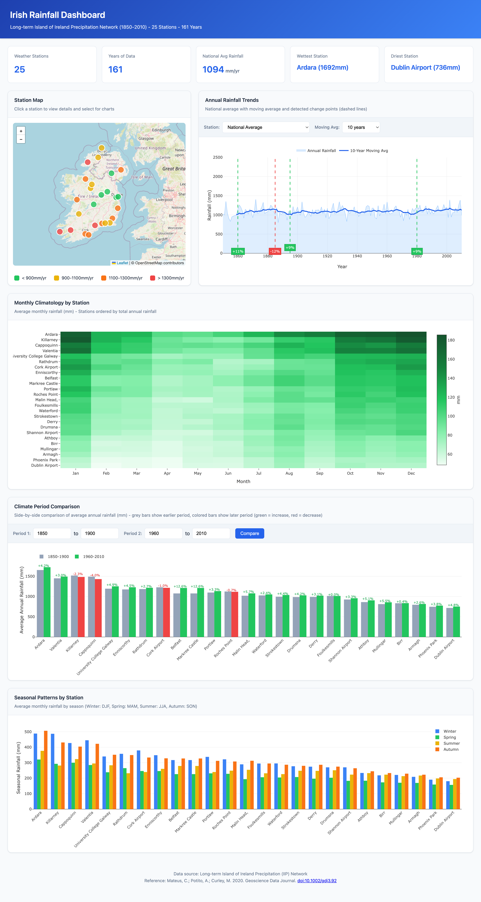

# Irish Rainfall Dashboard

Analysis tools and interactive dashboard for the Long-term Island of Ireland Precipitation (IIP) network dataset (1850-2010).



## Features

- **Interactive Map**: 25 weather stations on a Leaflet map, color-coded by average rainfall. Click a station to view details or select from dropdown to highlight on map.
- **Time Series Chart**: Annual rainfall trends with configurable moving averages (5/10/20/30 years)
- **Change Point Detection**: Automatic detection of significant rainfall shifts using the ruptures PELT algorithm
- **Monthly Climatology Heatmap**: Average rainfall by station and month
- **Period Comparison**: Compare rainfall between any two time periods with percentage change
- **Seasonal Analysis**: Winter/Spring/Summer/Autumn breakdown by station

## Dataset

The dataset contains monthly rainfall measurements from 25 weather stations across Ireland, spanning 161 years from 1850 to 2010. Data is sourced from [Met Éireann](https://www.met.ie/).

**Key Statistics:**
- 25 Weather Stations
- 161 Years of Data (1850-2010)
- National Average: 1094mm/yr
- Wettest Station: Ardara (1692mm/yr)
- Driest Station: Dublin Airport (736mm/yr)

## Installation

```bash
uv sync
```

## Quick Start

Import the rainfall data (downloads automatically from Met Éireann):

```bash
invoke import-data
```

Start the dashboard:

```bash
invoke start
```

Then open http://127.0.0.1:8000 in your browser.

## Usage

### Import Data

Download and import data from Met Éireann (default):

```bash
invoke import-data
```

Or import from a local directory:

```bash
invoke import-data --source /path/to/csv/directory
```

Force re-import (overwrites existing database):

```bash
invoke import-data --force
```

### Dashboard Server

Start the server:

```bash
invoke start
```

Start on a different port:

```bash
invoke start --port 8080
```

Check server status:

```bash
invoke status
```

Stop the server:

```bash
invoke stop
```

### Change Point Detection

Run change point analysis from the command line:

```bash
uv run python -m irish_rainfall.changepoint
```

Options:
- `--station ID` - Analyze a specific station (default: national average)
- `--penalty VALUE` - Sensitivity (higher = fewer change points, default: 3.0)
- `--output json` - Output results as JSON

### Database Info

View database statistics:

```bash
invoke db-info
```

## API Endpoints

The dashboard includes a REST API:

- `GET /api/stations` - All station metadata
- `GET /api/rainfall/annual` - Annual totals
- `GET /api/rainfall/monthly` - Monthly data
- `GET /api/rainfall/seasonal` - Seasonal averages
- `GET /api/rainfall/climatology` - Monthly climatology
- `GET /api/rainfall/station-summary` - Summary stats per station
- `GET /api/rainfall/trends` - National trends with moving average
- `GET /api/rainfall/anomalies` - Departures from baseline
- `GET /api/rainfall/comparison` - Compare two periods
- `GET /api/rainfall/changepoints` - Detected change points

## Data Directory Structure

After running `invoke import-data`, the data directory contains:

```
data/
├── rainfall.db          # SQLite database with imported data
└── raw/                  # Raw data files from Met Éireann
    ├── *.csv             # 25 station CSV files + national series
    ├── IIP_station_metadata.pdf  # Station metadata documentation
    └── readme.txt        # Original dataset readme
```

## Reference

If you use this dataset, please cite:

> Mateus, C.; Potito, A.; Curley, M. 2020. Reconstruction of a long-term historical daily maximum and minimum air temperature network dataset for Ireland (1831-1968). *Geoscience Data Journal*. http://dx.doi.org/10.1002/gdj3.92

## Data Source

Data is downloaded from Met Éireann:
https://www.met.ie/cms/assets/uploads/2018/01/Long-Term-IIP-network-1.zip

## License

MIT
